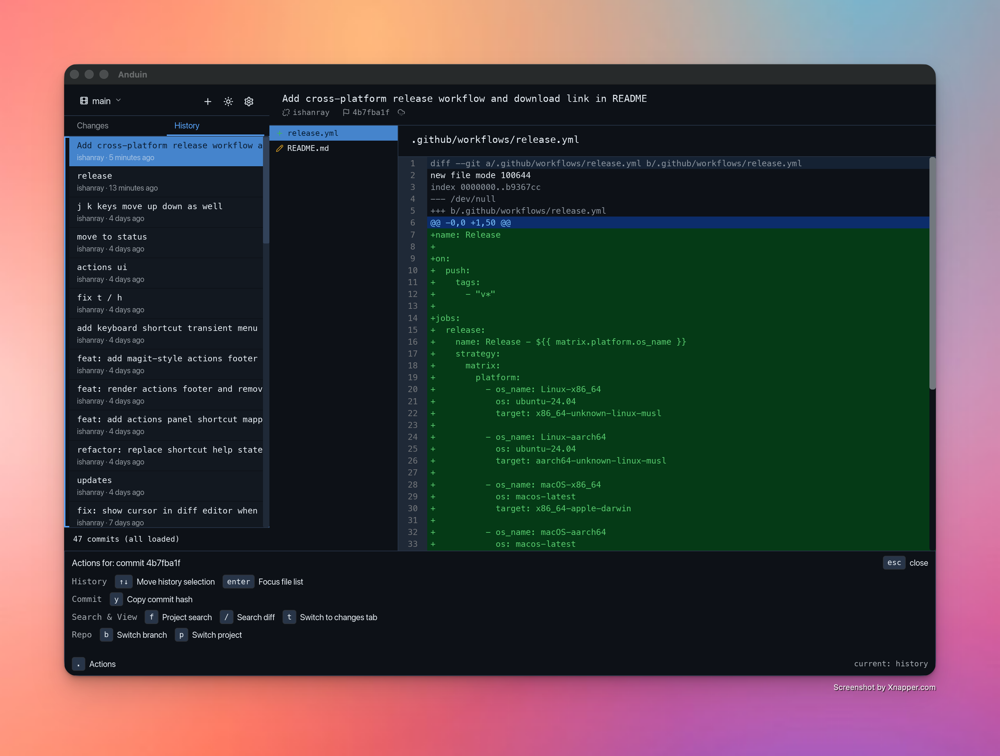
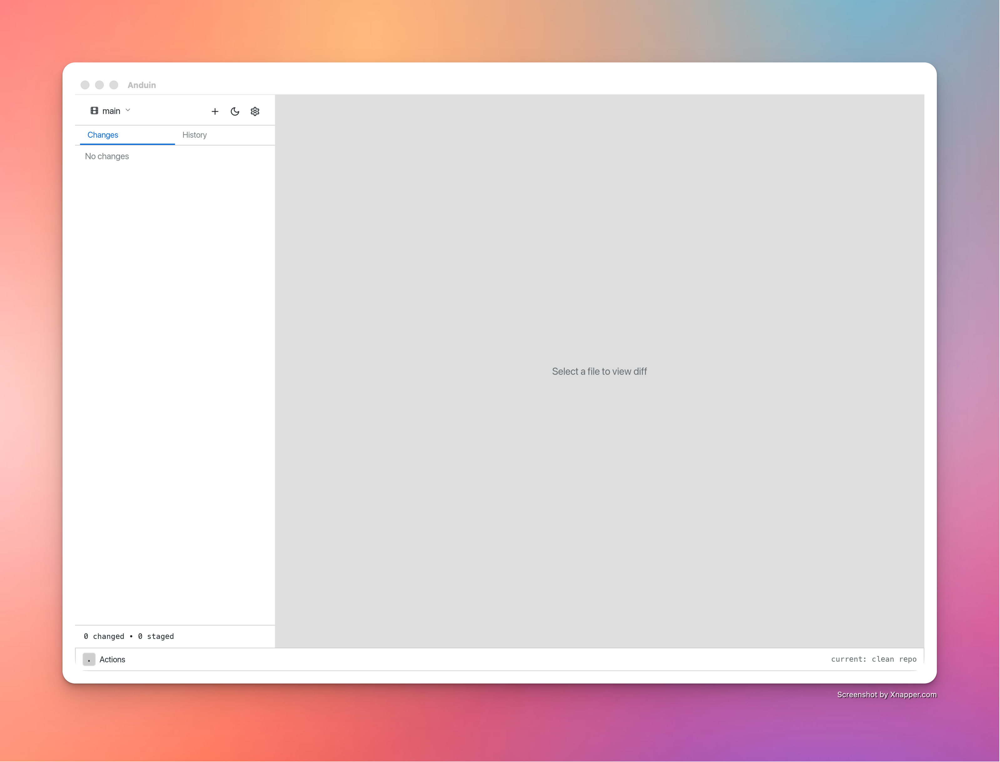

# Anduin

A fast Git GUI for coding-agent workflows and worktrees, built with Rust and [Iced](https://iced.rs).

<p align="center">
  
</p>

<p align="center">
  
</p>

## Download

Pre-built binaries for macOS, Linux, and Windows are available on the [Releases](https://github.com/ishanray/anduin/releases) page.

## Build from source

Requires Rust 1.85+.

```
cargo build --release
```

The binary is at `target/release/Anduin`.

### macOS app bundle

```
cargo install cargo-bundle
cargo bundle --release
```

## License

[Unlicense](LICENSE)
